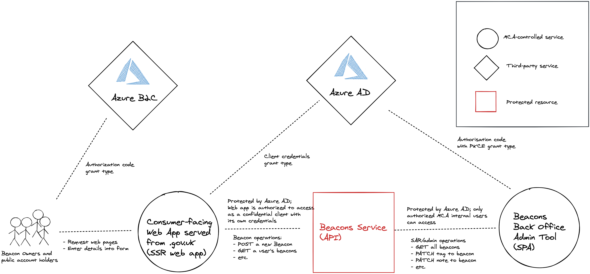

# Authorisation of access to the Beacons Service

## Status

Proposed

## Context

- The [Beacons Service](https://github.com/mcagov/beacons-service) provides sensitive user data, and as
  such only authorised clients should be able to access it.
- The Maritime & Coastguard Agency requires that [Azure Active Directory](https://azure.microsoft.com/en-gb/services/active-directory/) is used as the common authorisation
  and identity provider for its internal, "back office" services.
- The Maritime & Coastguard Agency requires that [Azure AD B2C](https://azure.microsoft.com/en-gb/services/active-directory/) is used as the common authorisation and identity
  provider for its external, "consumer-facing" services.

(Note that Azure AD is a distinct product from Azure AD B2C and on-prem Active Directory for Windows Server. More info
[here](https://www.predicagroup.com/blog/azure-ad-b2b-b2c-puzzled-out/).)

## Decision

_What is the change that we're proposing and/or doing?_

We will implement a blended authorisation architecture for the Beacons domain using Azure B2C for public-facing
accounts, Azure AD for internal accounts with role-based access control, and application code.

1.  End-users (members of the public: beacon owners, account holders) will authenticate using Azure B2C to
    access the consumer-facing [Web App](https://github.com/mcagov/beacons-webapp).
2.  The Web App will authenticate with Azure AD as a [confidential client application](https://docs.microsoft.com/en-us/azure/healthcare-apis/fhir/register-confidential-azure-ad-client-app) to access the
    Beacons [Service API](https://github.com/mcagov/beacons-service) with scope to perform CRUD operations on all
    beacon records.
3.  Application code in the Web App will restrict the permissions of the current Beacon Owner / public account
    holder to operate only on beacon records within their scope.
4.  Maritime & Coastguard Agency internal users will authenticate using Azure AD to access the Beacons [Back Office
    Admin Tool](https://github.com/mcagov/beacons-backoffice). The Maritime & Coastguard Agency's production tenant
    will be used to allow Single Sign-On. Using Azure AD will allow role-based access control of back office
    operations, giving the ability to make Search & Rescue users 'read only' while allowing Beacon Registration Team
    users to add flags, comments and other metadata.

.

## Key Benefits

_List the main benefits of this implementation._

- Commonality with other Maritime & Coastguard Agency services.

- Single-sign on for internal users.

- The lowest implementation effort (see alternatives).

## Key Drawbacks

_List any significant drawbacks from this implementation._

- Setting the consumer-facing web app as a confidential client which authenticates with the Beacons Service API with
  an API key foregoes the opportunity to implement delegated access, where the OAuth 2.0 protocol manages end-users
  directly authorising access to their beacons in the API. Knowledge of which user is performing an operation via
  the Web App must be implemented in the application.
  - The confidential client key held by the Web App represents a larger blast radius in the event of a compromised
    credential than the alternative delegation model (see alternative).

## Alternatives

_Summarise the main alternatives that have been considered and the reasons why they have not been chosen. Use no
more than one paragraph per alternative._

1.  **Full OAuth 2.0 delegation model**. The beacon owner / account holder is made a true OAuth 2.0 resource owner that
    delegates access to the protected resource (beacon records) to the client (consumer-facing Web App). The
    resource owner would authenticate with B2C; the webapp would be delegated privileges to call the API on the
    resource owner's behalf, so no client credential would be necessary in the webapp. This would be advantageous in
    that beacon operations would be intrinsically tied to the user that initiated them, rather than
    application code in the Web App having to manage linking an action with a user. An access token would, in
    theory, also only provide access to the beacon owner's beacons, limiting the blast radius of a compromised
    credential. This approach would be disadvantageous in that the Beacons Service would have to manage two
    authorisation providers, and the additional system complexity vs the confidential client application model proposed.
2.  **Alternative auth providers**. OAuth 2.0 provider(s) other than Azure B2C and Azure AD are used. This is
    discounted because it would not fulfill the Maritime & Coastguard Agency's vision for a common auth platform
    across its services.

## Consequences

_What becomes easier or more difficult to do because of this change?_

This change enables completion of authentication and authorisation tickets in the public-facing Web App.

## Supporting Documentation

- https://trello.com/c/ywhCzRZi
- https://trello.com/c/jvQTP55X
- https://trello.com/c/AJetbAAk
- https://trello.com/c/EHm1Lu9V
- https://trello.com/c/YWQ3zNrJ
- https://trello.com/c/5On3XnOa
- https://trello.com/c/8YuBjla9
